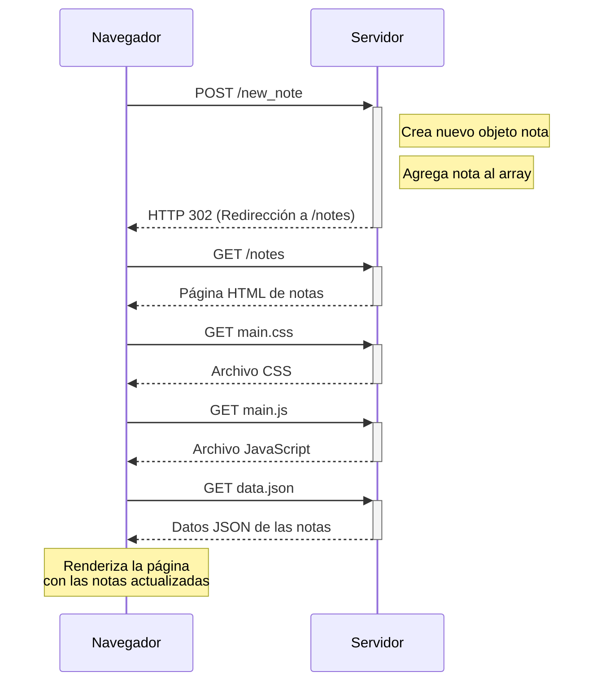
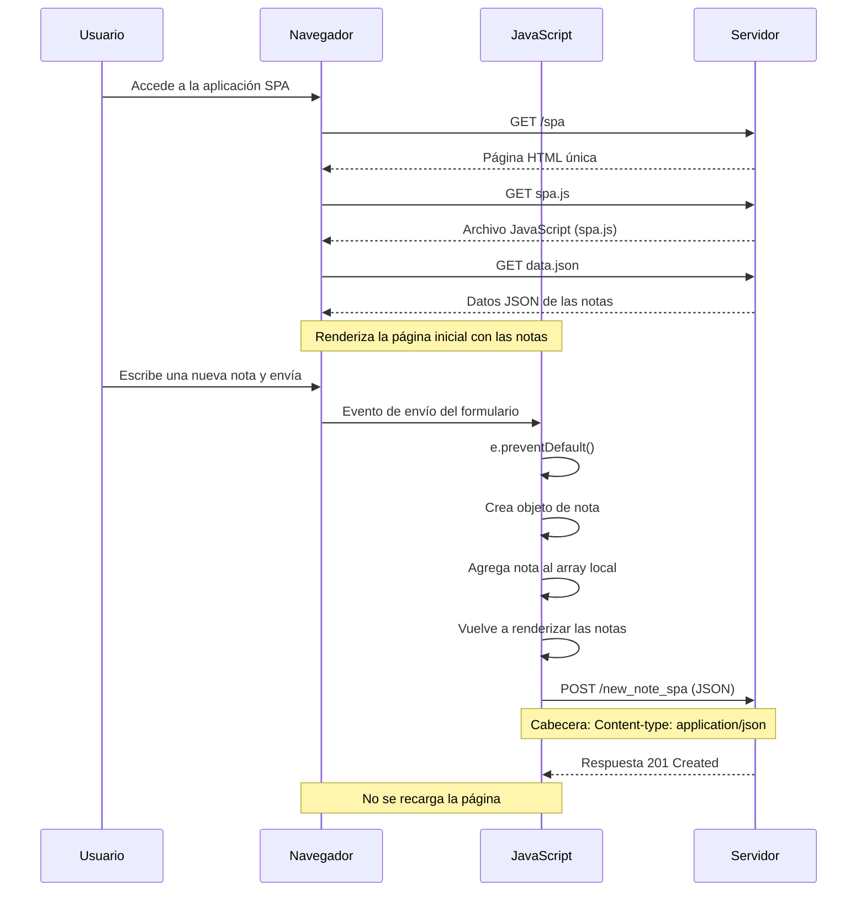

### 0.4: Nuevo diagrama de nota

```mermaid
sequenceDiagram
    participant Navegador
    participant Servidor
    
    Navegador->>+Servidor: POST /new_note
    Note right of Servidor: Crea nuevo objeto nota
    Note right of Servidor: Agrega nota al array
    Servidor-->>-Navegador: HTTP 302 (Redirección a /notes)
    
    Navegador->>+Servidor: GET /notes
    Servidor-->>-Navegador: Página HTML de notas
    
    Navegador->>+Servidor: GET main.css
    Servidor-->>-Navegador: Archivo CSS
    
    Navegador->>+Servidor: GET main.js
    Servidor-->>-Navegador: Archivo JavaScript
    
    Navegador->>+Servidor: GET data.json
    Servidor-->>-Navegador: Datos JSON de las notas
    
    Note over Navegador: Renderiza la página<br>con las notas actualizadas
```   
### 0.5: Diagrama de aplicación de una sola página

```mermaid
sequenceDiagram
    participant Usuario
    participant Navegador
    participant JavaScript
    participant Servidor

    Usuario->>Navegador: Accede a la aplicación SPA
    Navegador->>Servidor: GET /spa
    Servidor-->>Navegador: Página HTML única
    Navegador->>Servidor: GET spa.js
    Servidor-->>Navegador: Archivo JavaScript (spa.js)
    Navegador->>Servidor: GET data.json
    Servidor-->>Navegador: Datos JSON de las notas

    Note over Navegador,JavaScript: Renderiza la página inicial con las notas

    Usuario->>Navegador: Escribe una nueva nota y envía
    Navegador->>JavaScript: Evento de envío del formulario
    JavaScript->>JavaScript: e.preventDefault()
    JavaScript->>JavaScript: Crea objeto de nota
    JavaScript->>JavaScript: Agrega nota al array local
    JavaScript->>JavaScript: Vuelve a renderizar las notas
    JavaScript->>Servidor: POST /new_note_spa (JSON)
    Note over JavaScript,Servidor: Cabecera: Content-type: application/json
    Servidor-->>JavaScript: Respuesta 201 Created
    
    Note over Navegador,JavaScript: No se recarga la página
```