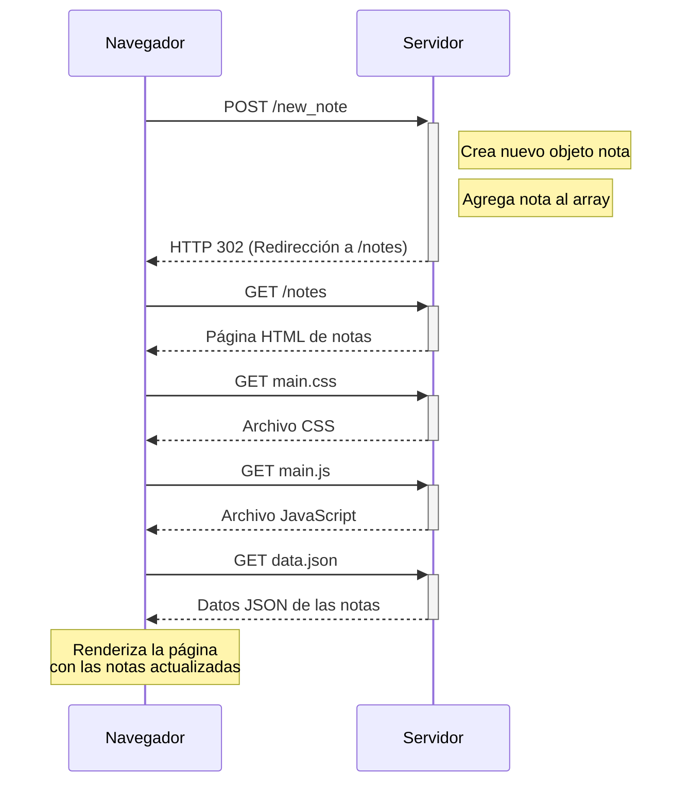

### 0.4: Nuevo diagrama de nota

```mermaid
sequenceDiagram
    participant Navegador
    participant Servidor
    
    Navegador->>+Servidor: POST /new_note
    Note right of Servidor: Crea nuevo objeto nota
    Note right of Servidor: Agrega nota al array
    Servidor-->>-Navegador: HTTP 302 (Redirección a /notes)
    
    Navegador->>+Servidor: GET /notes
    Servidor-->>-Navegador: Página HTML de notas
    
    Navegador->>+Servidor: GET main.css
    Servidor-->>-Navegador: Archivo CSS
    
    Navegador->>+Servidor: GET main.js
    Servidor-->>-Navegador: Archivo JavaScript
    
    Navegador->>+Servidor: GET data.json
    Servidor-->>-Navegador: Datos JSON de las notas
    
    Note over Navegador: Renderiza la página<br>con las notas actualizadas
```   
